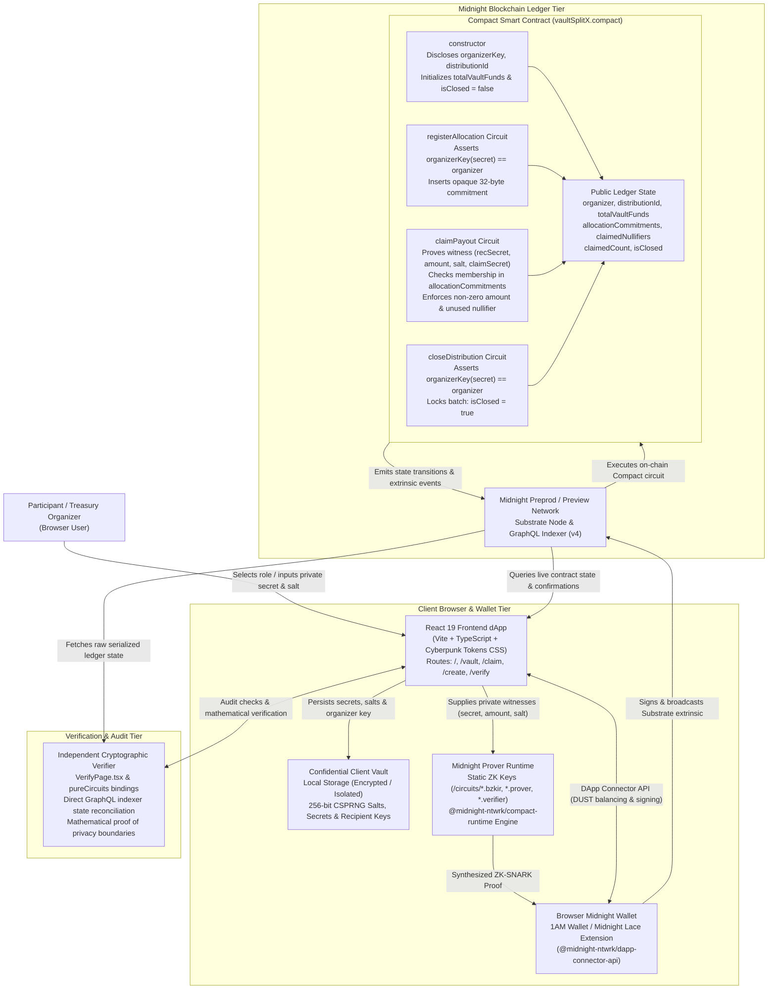
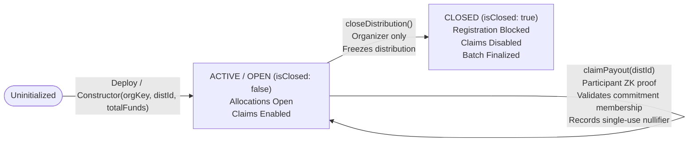
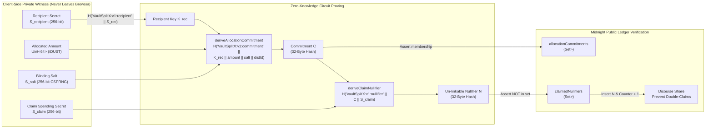
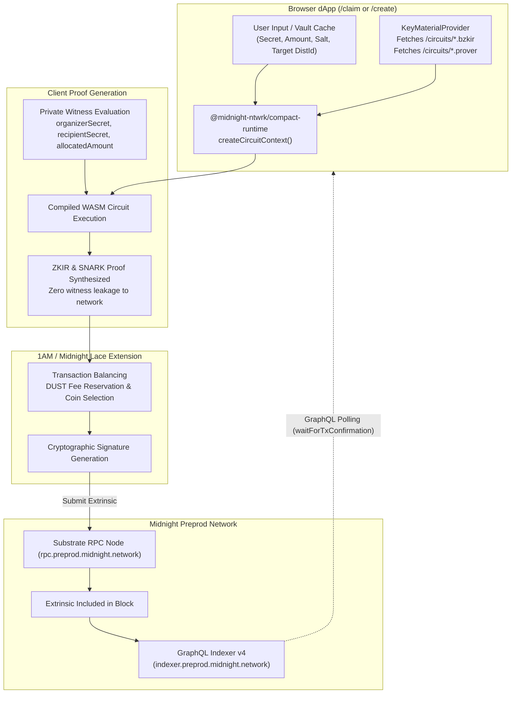

# VaultSplitX: System Architecture

VaultSplitX is a decentralized, privacy-preserving payment distribution and treasury protocol designed natively for the **Midnight blockchain**. The protocol leverages Midnight Compact smart contracts, client-side zero-knowledge proofs (witnesses never leaving the claimant's browser), domain-separated persistent hashing, un-linkable nullifier sets, and independent cryptographic audit verification to enable DAOs, enterprises, and freelance collectives to disburse shared funds without publicly exposing individual payment amounts or recipient identities.

---

## System Context

---

## Component Responsibilities

| Component | Location | Responsibility |
|:---|:---|:---|
| **Frontend dApp** | `src/` | React 19 + TypeScript + Vite user interface providing treasury overview (`/`), active vault inspection (`/vault`), confidential allocation claiming (`/claim`), distribution creation (`/create`), and real-time ledger auditing (`/verify`). |
| **Wallet Connector** | `src/midnight/wallet.ts`, `src/context/WalletContext.tsx` | Manages 1AM and Midnight Lace extension connectivity, network toggling between Preprod and Preview, DUST balance inquiries, persistent session restoration, and extrinsic signing via `@midnight-ntwrk/dapp-connector-api`. |
| **Compact Smart Contract** | `contracts/vaultSplitX.compact` | Native Midnight zero-knowledge smart contract declaring dual-state transitions across core circuits (`registerAllocation`, `claimPayout`, `closeDistribution`) and pure circuit helpers (`deriveOrganizerKey`, `deriveRecipientKey`, `deriveAllocationCommitment`, `deriveClaimNullifier`). |
| **Key Material & Prover Provider** | `/circuits/`, `src/midnight/contract.ts` | Serves compiled WASM/BZKIR bytecode, prover keys (`.prover`), and verifier keys (`.verifier`); synthesizes ZK proofs locally via `@midnight-ntwrk/compact-runtime` without transmitting witnesses across the network. |
| **Cryptographic Core & Storage Vault** | `src/midnight/crypto.ts`, `src/utils/contract.ts`, `src/context/VaultContext.tsx` | Implements 256-bit CSPRNG entropy generation, Bech32m address encoding (`mn_addr_preprod*`), organizer secret browser caching, and zero-knowledge circuit hashing bindings (`pureCircuits`). |
| **Midnight GraphQL Indexer** | Preprod Endpoint (`api/v4/graphql`) | High-throughput query service used to fetch live serialized contract state (`contractAction(address)`), poll transaction confirmations (`transactions(offset)`), and index public commitment and nullifier sets. |
| **Independent Cryptographic Verifier** | `src/pages/VerifyPage.tsx`, `tests/vaultSplitX.test.ts` | Client-side mathematical verification engine testing commitment preimages, domain-separated hash derivations, nullifier uniqueness, and zero-leakage privacy boundaries. |

---

## Vault & Distribution Lifecycle State Machine Pipeline

### Protocol Phases:

1. **Phase 1: Vault Deployment & Parameter Commitment**
   - The organizer generates an organizer secret $S_{\text{organizer}}$ and derives public key $K_{\text{organizer}} = \mathcal{H}(\text{"VaultSplitX:v1:organizer"} \,\|\, S_{\text{organizer}})$.
   - The contract constructor registers $K_{\text{organizer}}$, sets the unique batch identifier `distributionId`, deposits `totalVaultFunds` (e.g., $100{,}000\text{ tDUST}$), and marks `isClosed = false`.

2. **Phase 2: Confidential Allocation Registration**
   - For each recipient, the organizer or off-chain distribution coordinator derives the recipient key $K_{\text{rec}} = \mathcal{H}(\text{"VaultSplitX:v1:recipient"} \,\|\, S_{\text{recipient}})$.
   - A unique 256-bit cryptographic blinding salt $S_{\text{salt}}$ is generated.
   - The allocation commitment is computed:
     $$C = \mathcal{H}(\text{"VaultSplitX:v1:commitment"} \,\|\, K_{\text{rec}} \,\|\, \text{amount} \,\|\, S_{\text{salt}} \,\|\, \text{distributionId})$$
   - The organizer signs a `registerAllocation` transaction submitting $C$. The contract verifies that the caller matches $K_{\text{organizer}}$ and records $C$ in `allocationCommitments`.

3. **Phase 3: Confidential Payout Claim**
   - The eligible participant loads their private witness tuple: $(S_{\text{recipient}}, \text{amount}, S_{\text{salt}}, S_{\text{claim}})$.
   - Client-side ZK-SNARK circuit proves:
     - Knowledge of preimage yielding commitment $C$.
     - Membership of $C$ in on-chain `allocationCommitments`.
     - Entitlement amount $> 0$.
     - One-way derivation of nullifier $N = \mathcal{H}(\text{"VaultSplitX:v1:nullifier"} \,\|\, C \,\|\, S_{\text{claim}})$.
   - The contract asserts $N \notin \text{claimedNullifiers}$, inserts $N$, and increments `claimedCount`. Observers see only $N$ and know a valid claim occurred, without learning who claimed or the amount disbursed.

4. **Phase 4: Vault Closure & Final Settlement**
   - When all allocations have been claimed or the payment window concludes, the organizer invokes `closeDistribution()`.
   - The contract verifies the organizer's secret key and sets `isClosed = true`, permanently preventing further registrations or claims.

---

## Confidential Allocation Commitment & Nullifier Pipeline

### Cryptographic Properties & Guarantees:

- **Domain Separation**: All hashing uses Midnight's `persistentHash` with distinct domain-separated ASCII prefixes (`VaultSplitX:v1:organizer`, `VaultSplitX:v1:recipient`, `VaultSplitX:v1:commitment`, `VaultSplitX:v1:nullifier`), eliminating cross-protocol or cross-circuit preimage collision attacks.
- **Rainbow Table & Dictionary Attack Immunity**: High-entropy 256-bit cryptographic blinding salts ($S_{\text{salt}}$) guarantee that even small, discrete payment amounts (e.g., $100\text{ DUST}$, $500\text{ DUST}$) cannot be reversed via dictionary searches or precomputed rainbow tables.
- **Unlinkability**: The nullifier $N = \mathcal{H}(\text{"VaultSplitX:v1:nullifier"} \,\|\, C \,\|\, S_{\text{claim}})$ is cryptographically isolated from both the recipient's wallet address and the commitment $C$. An external observer or indexer cannot deduce which registered commitment corresponded to a given settled nullifier.

---

## Client-Side Proof Synthesis & Transaction Submission Pipeline

- **Zero Witness Exposure**: All witness functions (`organizerSecret`, `recipientSecret`, `allocatedAmount`, `allocationSalt`, `claimSecret`) execute strictly inside the browser memory during local circuit evaluation. Neither the indexer, the Substrate RPC node, nor external observers ever receive uncommitted secrets.
- **Asynchronous Proof Feedback**: The frontend manages the intensive client-side proving phase with user warnings (`Generating zero-knowledge proof… this can take up to a minute. Please don't close this tab.`), preventing concurrency collisions and accidental tab closures.
- **Real-Time Extrinsic Confirmation**: After submitting the extrinsic, the client polls the Midnight GraphQL indexer (`waitForTxConfirmation`) every 2 seconds until the transaction hash is verified in a minted block height.

---

## Dual-State Privacy Model & Data Boundary Matrix

| State Parameter | Data Classification | Storage Location | Accessible To | Zero-Knowledge Proven Invariant |
|:---|:---|:---|:---|:---|
| **Organizer Key ($K_{\text{org}}$)** | Public Ledger | Midnight On-Chain State | Anyone / Auditors | Proves administrative authority to register allocations and close batches. |
| **Distribution ID** | Public Ledger | Midnight On-Chain State | Anyone / Auditors | Proves that the claimed payout belongs to the specific active distribution batch. |
| **Total Vault Funds** | Public Ledger | Midnight On-Chain State | Anyone / Auditors | Proves the aggregate solvency of the treasury deposit. |
| **Allocation Commitments ($C$)** | Public Ledger | On-Chain `Set<Bytes<32>>` | Anyone / Auditors | Proves that an authorized allocation exists without revealing recipient or amount. |
| **Spent Nullifiers ($N$)** | Public Ledger | On-Chain `Set<Bytes<32>>` | Anyone / Auditors | Proves that an allocation cannot be claimed more than once. |
| **Claim Counter (`claimedCount`)** | Public Ledger | On-Chain `Counter` | Anyone / Auditors | Public tally of completed claims. |
| **Batch Lifecycle (`isClosed`)** | Public Ledger | On-Chain `Boolean` | Anyone / Auditors | Enforces that no claims or registrations occur after batch closure. |
| **Organizer Secret ($S_{\text{org}}$)** | Private Witness | Client Local Storage / Memory | Organizer Only | Prover proves $\mathcal{H}(\text{"VaultSplitX:v1:organizer"} \,\|\, S_{\text{org}}) == K_{\text{org}}$. |
| **Recipient Secret ($S_{\text{rec}}$)** | Private Witness | Claimant Vault / Memory | Recipient Only | Prover proves derivation of $K_{\text{rec}}$ matching commitment $C$. |
| **Allocated Amount** | Private Witness | Claimant Vault / Memory | Recipient & Organizer | Prover proves $\text{amount} > 0$ and hashes directly into commitment $C$. |
| **Blinding Salt ($S_{\text{salt}}$)** | Private Witness | Claimant Vault / Memory | Recipient Only | Prover proves salt binds commitment $C$ without exposing entropy. |
| **Claim Secret ($S_{\text{claim}}$)** | Private Witness | Claimant Vault / Memory | Recipient Only | Prover derives nullifier $N$ ensuring strict un-linkability. |

---

## Key Architectural Invariants

1. **Zero Witness Exposure**: Uncommitted compensation amounts, 256-bit blinding salts, recipient keys, and spending secrets reside exclusively in client memory and local browser storage; they are never transmitted to backend servers, indexers, or ledger state.
2. **Cryptographic Unlinkability**: Publicly recorded nullifiers are one-way hash outputs. Observers can mathematically verify that a claim was authorized, but cannot link which nullifier corresponds to which registered allocation commitment or claimant wallet address.
3. **Sybil & Replay Resistance**: On-chain nullifier tracking ensures that every registered commitment can be claimed exactly once. Attempting to submit a second claim with the same allocation preimage fails on-chain set membership assertion.
4. **Organizer Non-Tamperability**: Once commitments are registered on-chain, the vault organizer cannot modify, redirect, or claw back participant shares. Payout disbursements can only be initiated by the holder of the valid private preimage witness.
5. **Decentralized Auditability & Solvency**: Observers, auditors, and participants can independently execute the verification algorithm in-browser (`/verify`) or via pure circuit unit tests (`npm test`) to audit ledger parameters, commitment calculations, and state integrity without trusting third-party services.
6. **Pure Web3 Architecture**: Complete elimination of centralized intermediary servers, databases, or custody providers; the entire lifecycle operates peer-to-peer between the client browser, Midnight Substrate node, and decentralized wallet extensions.
